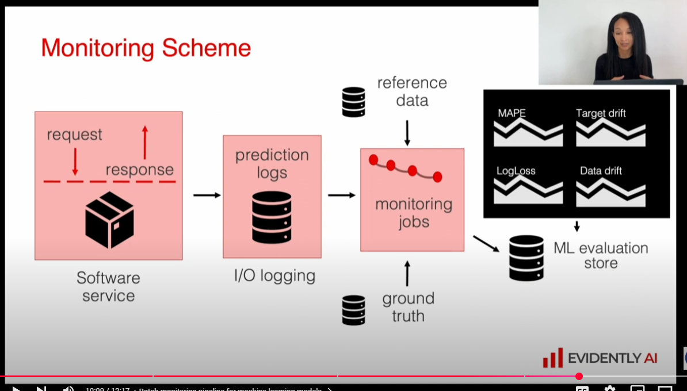

# Intro to Monitoring

## Why Monitor Models

1 . Model performance can degrade over time through
 - Data Drift - when the new input data is has changed compared to what the mode was trained on
  - Concept drift, when the relationship between inputs and outputs changes, even if the data itself hasn't changed. For example, if the taxi cars are replaced by newer vehicles, the old model might not work the same.

  ## What should i monitor

  1. Service health - general health checks for software
  2. Mdoel perofrmance - specific to the problem that the model is solving
  3. Data quality and Integrity - of input data
  4. Data and Concept drift - (like above)

  In addition, it would be good to monitor:

  5 . Performance by segment - if the space is large, we would want to see how performance in different segments matter. 
  6. Model bias / Farinses
  7. Outliers - anomalous input data points
  8. Explainability

  # batch vs non-batch models

  ## Batch models 
  - compare against training data or last batch
   - expected data quality
   - data distribution type 
   - descriptive statistics, min, max, median
   - use point estimation as a basic solution
   - use statistical tests for confidence interval

   ## Non-batch models
    - can do descriptive statittics continuously
    - do statistical tests on continuous data stream, picking a window funcion. Compare windows

    # Montioring Scheme
     - applicable to both non-batch and batch inference?

     

# Environment Setup
Source video: https://www.youtube.com/watch?v=yixA3C1xSxc
 - The video uses conda, we will use uv for our puproses, as it seems we don't really need conda yet.
Note: this assumes all commands are done in the `05-monitoring` folder
1. Create workspace

`$ uv init` 

2. Add necessary packges

`$ uv add prefect tqdm requests joblib pyarrow psycopg psycopg_binary evidently pandas numpy scikit-learn jupyter`

Some notes on the packages
 - we're using prefect for orhestration (it's different than what I used in mmodule 3, but it should be ok)
 - evidently is the package we'll be using for monitoring
 - joblib is usually used for multi processing - might be required when running the evaluation metrics. 
 - psycopg - is for connecting to Postgres databases if I remember correctly. Looks like that' where we are storing data.

 3. Docker setup 
 - we'll want the following 
 - grafana 
 - postgres -to store data
 - adminer - as an SQL UI for looking into postgres.

 Note that in the `docker-compose.yml` file we created two netowrks -back-tier and front-tier. the DB will be in the back-tier, but both adminer and grafana will need to be on both, as these need access to postgres.

 To test that this works, access the following:

 1. http://localhost:8080 - you should see the adminer page. Login using the user `postgres` and the password you set in the POSTGRES_PASSWORD environment variable in the docker-compose ifle.
 2. http://localhost:300 - you shoud see the grafana page. You can log-in using the defautl username (`admin`) and password (`admin`). Grafana should ask you to change the password.

 # Prepare and Reference Model

  - It seems that the code is working off of an older version of evidently. so we need to use `evidently.legacy` for the packages.
  - also need to create the `./data/` folder
  - also had to add the matplotlib package, otherwise `.hist()` on the dataframe wouldn't work.
  - had to add the `./model/` folder
  - NOTE: nevermid  on the legacy stuff. There was an updated notebook on evidently post 0.7. Using that.
## Evidently Report
  - It looks like we're keeping the validation data as the reference data- this will probably be uesd for comparison to future data sets later on
  - The `DataDefinition` object just specifies the types of the columns (muerical or categorical features)
  - the Dataset object seems to just be the pandas dataframe combined with the DataDefinition
  - you create a Report object which defines what will be checked. It will need a list of `metrics`. So far we used the following:
     - ValueDrift - for specifying when the distribution of values has changed between reference and current. This seems to be using the [Wassertein metric](https://en.wikipedia.org/wiki/Wasserstein_metric). You will need to specify the columns to check. In this case, we only asked it to look at the prediction column - so this is actually tryin to detect [Prediction Drift](https://www.evidentlyai.com/ml-in-production/data-drift#data-drift-vs-prediction-drift)
     - DriftedColumnsCount - seems to run some sort of drift metric on all columns. Report shows two values
          - count -how many are the drifted columns
          - share -% of columns drifted( according to threshold).
     - MissingValueCount() - there to compare missing values across the data sets.
## 5.5 Evidently Dashboard
 - The dashboard seems to be there to allow you to generate reports and metrics for each dataset, and then be able to see the progression over time. This seems to be better for cases where you have non-batch inference. 

 # 5.6 Dummy Monitoring 
  - 